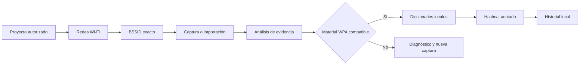

<div align="center">
  

  # WiFi Lab Auditor

  **Laboratorio inalámbrico local para inventario, captura y análisis de evidencia.**

  Diseñado para evaluaciones de redes propias o expresamente autorizadas, con alcance por proyecto, BSSID y cliente.

  <p>
    <a href="https://github.com/byalexsv/WiFi-Lab-Auditor/actions/workflows/tests.yml"></a>
    <a href="https://github.com/byalexsv/WiFi-Lab-Auditor/actions/workflows/lint.yml"></a>
    <a href="https://github.com/byalexsv/WiFi-Lab-Auditor/blob/main/LICENSE"></a>
    
    
  </p>
</div>

> [!IMPORTANT]
> WiFi Lab Auditor solo debe utilizarse sobre redes, dispositivos y capturas que puedas auditar legalmente. El proyecto conserva controles de alcance: una red descubierta no entra automáticamente en el laboratorio y cada operación se asocia a un proyecto y a un BSSID autorizado.

## Qué es

WiFi Lab Auditor es una aplicación de escritorio Qt para Kali/Linux que reúne en un mismo flujo:

- inventario de radios Wi-Fi consultado desde NetworkManager;
- proyectos con registro explícito de autorización;
- captura real con `dumpcap` sobre el BSSID seleccionado;
- importación y análisis de PCAP/PCAPNG con TShark y HCX;
- descubrimiento de clientes visibles para el BSSID actual;
- recuperación offline acotada con Hashcat y uno o varios diccionarios locales;
- historial persistente, evidencia, diagnósticos, cancelación y limpieza local.

La aplicación trabaja localmente. No sube capturas, hashes, contraseñas ni resultados a ningún servicio externo.

## Flujo de trabajo



Cada radio se identifica por su BSSID. Un mismo SSID puede aparecer varias veces porque tiene radios 2,4 GHz, 5 GHz o 6 GHz distintas; la captura debe apuntar a la radio donde está asociado el cliente autorizado.

## Inicio rápido

### 1. Clonar el repositorio

```bash
git clone https://github.com/byalexsv/WiFi-Lab-Auditor.git
cd WiFi-Lab-Auditor
```

### 2. Preparar Kali/Linux

El instalador crea el entorno virtual y comprueba las herramientas disponibles:

```bash
./scripts/install-kali.sh
```

Si el equipo aún no tiene las dependencias del sistema, instálalas una vez:

```bash
sudo apt install \
  python3-venv python3-pyqt6 python3-sqlalchemy \
  network-manager iw aircrack-ng tshark wireshark-common \
  hcxtools hcxdumptool hashcat policykit-1
```

### 3. Ejecutar

```bash
./scripts/run.sh
```

La aplicación debe ejecutarse como usuario normal desde la sesión gráfica. No es necesario abrir toda la interfaz con `sudo`. El indicador superior muestra `SYSTEM ONLINE` cuando las comprobaciones del backend pasan y `SYSTEM OFFLINE` cuando falta una herramienta o falla el acceso requerido.

## Primer laboratorio

1. Abre **Proyectos**, crea un proyecto y registra quién autoriza la evaluación.
2. En **Redes Wi-Fi**, ejecuta **Buscar redes**, selecciona el BSSID correcto y añádelo al proyecto.
3. En **Capturas**, selecciona la red autorizada. El canal y la frecuencia se rellenan desde el inventario.
4. Si el adaptador está gestionado, confirma el cambio y pulsa **Preparar monitor…**. La transición utiliza autorización del sistema mediante polkit y puede desconectar ese adaptador.
5. Mantén un cliente autorizado asociado a la radio seleccionada. La interfaz observa automáticamente clientes que transmiten datos o tienen una asociación real.
6. Pulsa **Iniciar captura**. La duración recomendada es de 120 segundos cuando se usa la reconexión automática.
7. Selecciona el registro terminado y revisa **Evidencia**. Los mensajes EAPOL observados y el material convertible se muestran por separado.

La aplicación usa una sola reconexión dirigida sobre el cliente seleccionado y autorizado. No ejecuta campañas de difusión ni desautenticaciones masivas. Si no hay material recuperable, conserva la captura y explica si faltó el BSSID, tráfico de datos o una autenticación EAPOL.

## Recuperación offline

La recuperación solo se habilita para una captura cuyo análisis haya producido material WPA compatible y dentro del alcance del proyecto.

1. Abre **Recuperación** y selecciona la captura preparada.
2. Pulsa **Añadir diccionarios…** y selecciona varios archivos con `Ctrl` o `Shift`.
3. La cola respeta el orden en que aparecen los archivos. También puedes quitar seleccionados o limpiar la lista.
4. Define el tiempo máximo por diccionario, entre 10 y 3600 segundos.
5. Pulsa **Iniciar recuperación**. Los diccionarios se prueban secuencialmente sin intervención entre ellos.

La pantalla muestra el diccionario actual, su posición en la cola, pruebas realizadas, velocidad, porcentaje y coincidencias verificadas. Cada diccionario ejecutado crea una fila propia en el historial. La cola se detiene cuando encuentra un resultado recuperable; si un diccionario se agota, continúa con el siguiente. El resultado se conserva localmente y solo se muestra mediante **Mostrar resultado local…**.

Un tiempo máximo no equivale a agotar el diccionario. WPA3-SAE y redes empresariales no se convierten automáticamente en material WPA-PSK 22000.

## Qué ocurre con los datos

| Dato | Ubicación | Comportamiento |
| --- | --- | --- |
| Base de datos real | `~/.local/share/wifi-lab-auditor/auditor.sqlite3` | Proyectos, alcance, estados e historial |
| Capturas y análisis | `~/.local/share/wifi-lab-auditor/artifacts/` | Un directorio privado por operación |
| Base de demostración | `demo.sqlite3` | Solo se usa con `WIFI_LAB_MOCK=1` |
| Resultado de recuperación | Dentro del directorio privado de la operación | No se copia al portapapeles ni se envía fuera del equipo |

El repositorio nunca debe contener PCAP, hashes, diccionarios, credenciales, BSSID privados ni bases de datos personales. El comprobador de release bloquea esos archivos antes de publicar.

## Modo demostración y pruebas

Para explorar la interfaz sin radio ni herramientas de captura:

```bash
WIFI_LAB_MOCK=1 WIFI_LAB_MOCK_SCENARIO=capture-valid ./scripts/run.sh
```

Para validar el proyecto completo:

```bash
./scripts/test.sh
./scripts/check-release.sh
```

La suite cubre alcance, persistencia, cancelación, análisis, recuperación, controles de la interfaz y protección contra archivos sensibles. Las pruebas usan datos sintéticos y no requieren root, GPU, radio real ni capturas privadas.

## Arquitectura

```text
UI Qt ──> servicios core ──> adaptadores de sistema
  │            │                    ├── NetworkManager / iw
  │            │                    ├── dumpcap
  │            │                    ├── TShark / HCX
  │            │                    └── Hashcat
  │            └── ScopeManager ──> SQLite
  └── Mock provider ──> fixtures sintéticos
```

- `app/ui/`: ventanas, páginas, estados y controles Qt.
- `app/core/`: alcance, procesos acotados, inventario, captura, análisis y recuperación.
- `app/database/`: modelos SQLite y migraciones.
- `app/models/`: tipos de evidencia y estados públicos.
- `fixtures/`: escenarios sintéticos para pruebas y demostración.
- `plugins/`: puntos de extensión para perfiles, parsers y reportes.
- `docs/`: arquitectura, desarrollo, vendors y proceso de release.

Consulta la [arquitectura detallada](docs/architecture.md) y la [guía de desarrollo](docs/development.md).

## Calidad y release

El repositorio ejecuta automáticamente pruebas y lint con GitHub Actions. Para crear un paquete Debian local:

```bash
./scripts/build-deb.sh
```

El paquete aparece en `dist/`, que está excluido del repositorio. Para una versión nueva, actualiza `pyproject.toml` y `CHANGELOG.md`, ejecuta `./scripts/check-release.sh` y crea un tag `vX.Y.Z`. El flujo de release construye el paquete y publica su checksum cuando el repositorio tiene habilitados los permisos de releases.

## Contribuir

1. Crea una rama enfocada para el cambio.
2. Ejecuta `./scripts/test.sh` y `./scripts/check-release.sh`.
3. Mantén el alcance por proyecto y no incluyas datos privados.
4. Describe la validación realizada en el pull request.

Lee [CONTRIBUTING.md](CONTRIBUTING.md), [SECURITY.md](SECURITY.md) y la plantilla de pull request antes de enviar cambios.

## Licencia

Distribuido bajo [GNU GPL v3.0](LICENSE).
